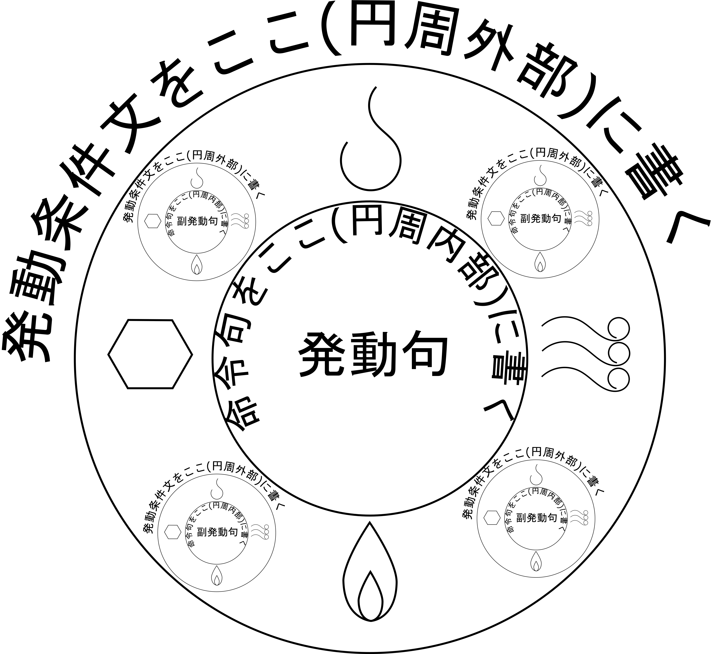

# 刻印式
[***刻印式***](.)とは、[発動媒体](mediator.md)に[呪文](spell.md)を刻み込むための記述方法とその体系である。

形式は上に示した通り。発動条件文は仮定法の文の仮定節を書き、命令句には動詞以外の部分を書く。発動句は動詞である。

外円と内円のうち、外円は発動条件がない(魔法素があれば発動し続ける)場合、省略することが可能。内円は必須である。

内円の外側には副発動式や属性紋を書くことができる。