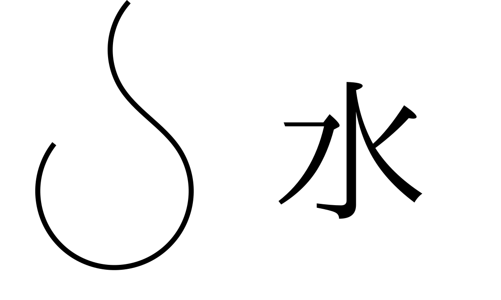

# 刻印式
[***刻印式***](.)とは、[発動媒体](mediator.md)に[呪文](spell.md)を刻み込むための記述方法とその体系である。

形式は上に示した通り。発動条件文は仮定法の文の仮定節を書き、命令句には動詞以外の部分を書く。発動句は動詞である。

外円と内円のうち、外円は発動条件がない(魔法素があれば発動し続ける)場合、省略することが可能。内円は必須である。

内円の外側には副発動式や属性紋を書くことができる。属性紋を省略した場合、指向性のない魔法素を放出するだけになってしまい、効率が低減する。副発動式は主発動式の発動条件にしたり、主発動式の効果を高めたりなど、様々な使い方が確立されている。

これは実際の刻印である。この場合、条件文は`es on pis picu`、命令句は`bise piro on pis yee`、発動句は`piro`であり、効果は「魔法媒体に何かが触れた場合、上に炎を5秒間発生させる」というものになる。

刻印式は[魔法素](magion.md)を伝達しやすい物質ならば何で書いてもよい。過去には空中に魔法素を使って記述した例(例えば崩壊爆弾)もあり、書かれるものにはほとんど依存しない。

## 属性紋
基本6属性の属性紋を下に示す。

近代魔法において光や闇は複合属性であり、ぞれぞれ火系統風複合属性、火系統風複合負属性である。これまでに発見されている複合属性の一覧を下に示す。

* 土系統
  * 水: 命(正) 死(負)
  * 火: 雷(正)
  * 風: 界(正)
* 風系統
  * 水: 天(正)
  * 火: 動(正)
  * 命: 精(正)
* 水系統
  * 土: 道(正)
  * 命: 血(正)
* 火系統
  * 風: 光(正) 闇(負)
  * 死: 獄(正)
* 時系統
  * 空: 場(正) 無(負)
  * 死: 転(正) 滅(負)
  * 命: 生(正)
* 空系統
  * 空系統には発見済み複合属性がない。

